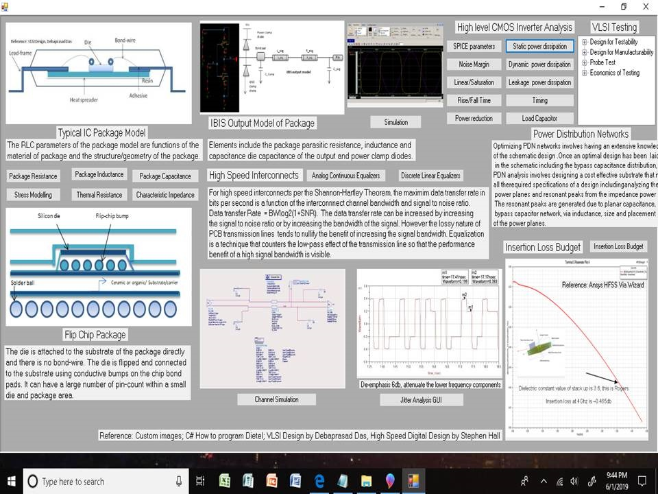

# Architectural Product Design

Overview of the project is provided. Confidential information is not displayed. Images are custom.

### MSECE
Advanced details please reference : https://github.com/alpaddesai/MedicalDevices, https://github.com/alpaddesai/RFMicroelectronics, https://github.com/alpaddesai/EmbeddedDesign, https://github.com/alpaddesai/SoC_Architecture, https://github.com/alpaddesai/EmbeddedSystemsArchitecture, https://github.com/alpaddesai/Hardware_Security, https://github.com/alpaddesai/Computer-Networking, https://github.com/alpaddesai/WirelessandMobileSystems,  https://github.com/alpaddesai/PCBSignalIntegrity_EEM, https://github.com/alpaddesai/ICPackageDesign , https://github.com/alpaddesai/MixedSignalDesign, https://github.com/alpaddesai/AntennaDesign, https://github.com/alpaddesai/VLSI_Design, https://github.com/alpaddesai/RealTimeOperatingSystems, https://github.com/alpaddesai/FirmwareDesign,  https://github.com/alpaddesai/Microwave-Engineering, https://github.com/alpaddesai/RFDesign,  https://github.com/alpaddesai/PowerManagementIntegratedCircuit, https://github.com/alpaddesai/Optoelectronics and https://github.com/alpaddesai/Microarchitecture 

#### Paid Employment: https://github.com/alpaddesai/PowerManagementIntegratedCircuit
#### Sample Revenue Generating Projects: https://github.com/alpaddesai/SpecialTopicsPowerDistributionNetworks
#### Popular Vote Project: https://github.com/alpaddesai/PCBDesignProcess

