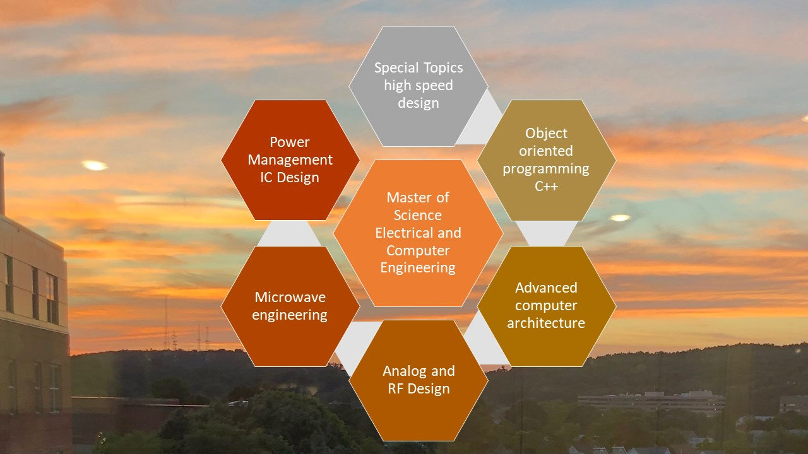

# Architectural Product Design

Overview of the project is provided. Confidential information is not displayed. Images are custom.

### MSECE
Advanced details please reference : https://github.com/alpaddesai/MedicalDevices, https://github.com/alpaddesai/RFMicroelectronics, https://github.com/alpaddesai/EmbeddedDesign, https://github.com/alpaddesai/WirelessNetworkingProducts, https://github.com/alpaddesai/SoC_Architecture, https://github.com/alpaddesai/EmbeddedSystemsArchitecture, https://github.com/alpaddesai/Hardware_Security, https://github.com/alpaddesai/Computer-Networking, https://github.com/alpaddesai/SimulationPerformance, https://github.com/alpaddesai/WirelessandMobileSystems, https://github.com/alpaddesai/MixedSignalDesign, https://github.com/alpaddesai/RFDesign,  https://github.com/alpaddesai/AntennaDesign, https://github.com/alpaddesai/CodingRTOS, https://github.com/alpaddesai/PowerManagementIntegratedCircuit2022,  https://github.com/alpaddesai/Optoelectronics and https://github.com/alpaddesai/Microarchitecture 

#### Popular vote project GUI ATM Dietel C# : https://github.com/alpaddesai/AdvancedSoftwareEngineering.

Additional details reference Additional details reference https://github.com/alpaddesai/GraduateDegrees and https://github.com/alpaddesai/TechnicalProjectManagement2022
